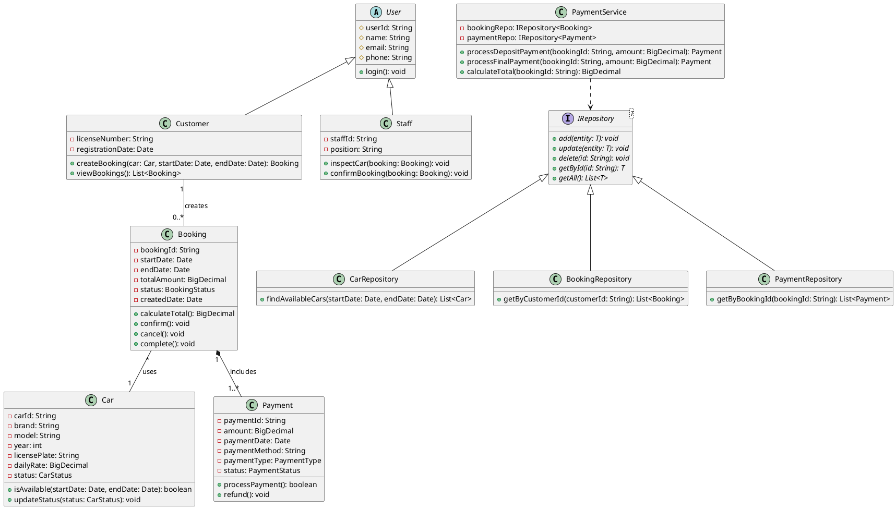

# Báo cáo Tuần 3 – Sử dụng AI để tham khảo kết quả về Class Diagram

## 1. Class Diagram là gì?

Tuần 3, em đã tìm hiểu về **Class Diagram** – một trong những biểu đồ quan trọng nhất của UML, dùng để mô hình hóa cấu trúc tĩnh (static structure) của hệ thống. Class Diagram mô tả các **lớp (class)**, **thuộc tính (attribute)**, **phương thức (method)** và **mối quan hệ (relationship)** giữa chúng.

Em hiểu rằng Class Diagram là kết quả của giai đoạn **phân tích thiết kế** – từ các use case đã xác định ở Tuần 1, ta phân tích để tìm ra các lớp đối tượng trong hệ thống.

---

## 2. Các thành phần của Class Diagram

### 2.1. Lớp (Class)

Một lớp được biểu diễn bằng hình chữ nhật chia làm 3 phần:

| Phần | Nội dung |
|---|---|
| **Phần 1 – Tên lớp** | Tên lớp (in đậm, căn giữa), ví dụ: `User`, `Booking`, `Car` |
| **Phần 2 – Thuộc tính** | Các thuộc tính với cú pháp: `visibility name: type = default` |
| **Phần 3 – Phương thức** | Các phương thức với cú pháp: `visibility name(params): returnType` |

Ký hiệu visibility:
- `+` : public
- `-` : private
- `#` : protected
- `~` : package (default)

### 2.2. Các mối quan hệ (Relationships)

Em đã tìm hiểu **4 loại quan hệ chính** trong Class Diagram:

| Quan hệ | Ký hiệu | Ý nghĩa |
|---|---|---|
| **Association** | Đường thẳng nối | Liên kết giữa các lớp (có thể kèm tên, multiplicity) |
| **Inheritance / Generalization** | Mũi tên tam giác rỗng | Quan hệ "is-a" – lớp con kế thừa lớp cha |
| **Aggregation** | Hình thoi rỗng | Quan hệ "has-a" – lớp chứa tham chiếu đến lớp khác (yếu) |
| **Composition** | Hình thoi đặc | Quan hệ "has-a" mạnh – lớp con không tồn tại nếu lớp cha bị hủy |
| **Dependency** | Mũi tên đứt nét | Quan hệ sử dụng tạm thời (dùng đối tượng làm tham số) |

### 2.3. Multiplicity (Bản số)

Em cũng nắm được các ký hiệu bản số phổ biến:

| Ký hiệu | Ý nghĩa |
|---|---|
| `1` | Một và chỉ một |
| `0..1` | Không hoặc một |
| `*` | Không hoặc nhiều (0..*) |
| `1..*` | Một hoặc nhiều |

---

## 3. Case Study: Hệ thống AutoGo

Để thực hành, em lấy đề bài **AutoGo – Car Rental System** làm case study:

> **AutoGo** là hệ thống cho thuê xe online. Khách hàng (Customer) xem xe, đặt xe, đặt cọc. Nhân viên (Staff) quản lý xe, xác nhận đặt xe, kiểm tra xe khi trả. Hệ thống áp dụng Repository Pattern, có các lớp: User, Customer, Staff, Car, Booking, Payment.

---

## 4. Cách AI hỗ trợ vẽ Class Diagram

### 4.1. Sinh lớp từ đặc tả Use Case (Business Overview)

Em đã sử dụng **ChatGPT / Copilot** để hỗ trợ quá trình phân tích.

**Cách thực hiện:**
1. Cung cấp cho AI mô tả nghiệp vụ của AutoGo.
2. Yêu cầu AI **đề xuất danh sách các lớp** (candidate classes) dựa trên danh từ trong đề bài.
3. Yêu cầu AI gán **thuộc tính** và **phương thức** cho từng lớp.
4. Yêu cầu AI xác định **mối quan hệ** giữa các lớp.
5. Yêu cầu AI sinh code **PlantUML**.

### 4.2. Prompt mẫu em đã sử dụng

```
Prompt gốc (tiếng Anh để AI hiểu chính xác hơn):

"Design a Class Diagram for a car rental system called AutoGo.
Apply Layered Architecture and Repository Pattern. The system has:

Domain classes:
- User (abstract): userId, name, email, phone
- Customer extends User: licenseNumber, registrationDate
- Staff extends User: staffId, position
- Car: carId, brand, model, year, licensePlate, dailyRate, status
- Booking: bookingId, startDate, endDate, totalAmount, status, createdDate
- Payment: paymentId, amount, paymentDate, paymentMethod, paymentType, status

Business rules:
- Customer can create multiple Bookings
- Each Booking links to exactly one Car
- A Booking may have one or more Payments (deposit + final)
- A PaymentService handles payment business logic
- Repositories implement IRepository<T> generic interface

Generate PlantUML code with correct:
- Inheritance (User -> Customer, User -> Staff)
- Composition (Booking -> Payment)
- Association with multiplicity
- Dependency (PaymentService -> IRepository)
- Interface realization (CarRepository : IRepository<Car>)
- All attributes and methods
```

### 4.3. Kết quả AI trả về – Danh sách lớp đề xuất

| Lớp | Thuộc tính tiêu biểu | Phương thức tiêu biểu |
|---|---|---|
| **User** (abstract) | `#userId`, `#name`, `#email`, `#phone` | `+login(): void` |
| **Customer** | `-licenseNumber`, `-registrationDate` | `+createBooking(...): Booking`, `+viewBookings(): List<Booking>` |
| **Staff** | `-staffId`, `-position` | `+inspectCar(booking): void`, `+confirmBooking(booking): void` |
| **Car** | `-carId`, `-brand`, `-model`, `-dailyRate`, `-status` | `+isAvailable(...): bool`, `+updateStatus(...): void` |
| **Booking** | `-bookingId`, `-startDate`, `-endDate`, `-totalAmount`, `-status` | `+calculateTotal(): decimal`, `+confirm(): void`, `+cancel(): void` |
| **Payment** | `-paymentId`, `-amount`, `-paymentDate`, `-paymentType`, `-status` | `+processPayment(): bool`, `+refund(): void` |

### 4.4. AI xác định mối quan hệ

| Quan hệ | Loại | Giải thích |
|---|---|---|
| User ──▷ Customer | Inheritance | Customer "is-a" User |
| User ──▷ Staff | Inheritance | Staff "is-a" User |
| Customer `1` ── `0..*` Booking | Association | Một customer có nhiều booking |
| Booking `*` ── `1` Car | Association | Mỗi booking gắn với đúng một xe |
| Booking `1` ◆─ `1..*` Payment | Composition | Booking hủy thì Payment cũng hủy |
| PaymentService ─ ─ ▷ IRepository`<T>` | Dependency | Service phụ thuộc vào repository |
| CarRepository ──▷ IRepository`<Car>` | Realization | Implements generic interface |

### 4.5. Sinh PlantUML từ AI

Sau nhiều lần chỉnh sửa, em có code PlantUML hoàn chỉnh:



Em copy code này vào [PlantUML Online](https://www.plantuml.com/) để render ra hình Class Diagram. Nếu dùng offline, em có thể cài PlantUML plugin trên VS Code hoặc dùng Draw.io.

---

## 5. Workflow hoàn chỉnh em đã áp dụng

```
[Mô tả nghiệp vụ AutoGo]
    → [ChatGPT: đề xuất lớp/thuộc tính/quan hệ]
    → [Kiểm tra, chỉnh sửa bằng kiến thức UML]
    → [ChatGPT: sinh code PlantUML]
    → [PlantUML: render Class Diagram]
    → [Export hình ảnh cho báo cáo / nộp bài]
```

---

## 6. Lưu ý khi dùng AI cho Class Diagram (rút ra từ case study AutoGo)

| Vấn đề | AI thường sai thế nào | Cách em fix |
|---|---|---|
| **Multiplicity** | Hay đặt `*` hai chiều không đúng | Tự suy luận: 1 Booking chỉ có 1 Car, nhưng 1 Car có nhiều Booking |
| **Kiểu dữ liệu** | Dùng `int` cho tiền thay vì `BigDecimal` | Sửa lại đúng kiểu trong thiết kế |
| **Repository Pattern** | Quên generic interface hoặc đặt sai | Nhắc AI "must implement IRepository<T>" |
| **Composition vs Aggregation** | Hay nhầm giữa thoi rỗng và thoi đặc | Booking-Payment là composition (hủy Booking thì Payment cũng mất) |
| **Tên phương thức** | Đặt tên không nhất quán | Chuẩn hóa theo naming convention Java/C# |

---

## 7. Kinh nghiệm rút ra

1. **AI giúp tiết kiệm thời gian** – từ mô tả nghiệp vụ, AI gợi ý ngay danh sách lớp và code PlantUML.
2. **Cần hiểu lý thuyết trước** – nếu không biết Composition vs Aggregation, sẽ không phát hiện lỗi AI.
3. **Multiplicity là lỗi phổ biến nhất** – luôn kiểm tra lại bằng logic nghiệp vụ.
4. **Repository Pattern khó với AI** – thường phải nhắc nhiều lần mới đúng.
5. **AI là công cụ tham khảo** – quyết định cuối cùng vẫn dựa trên kiến thức của người thiết kế.
